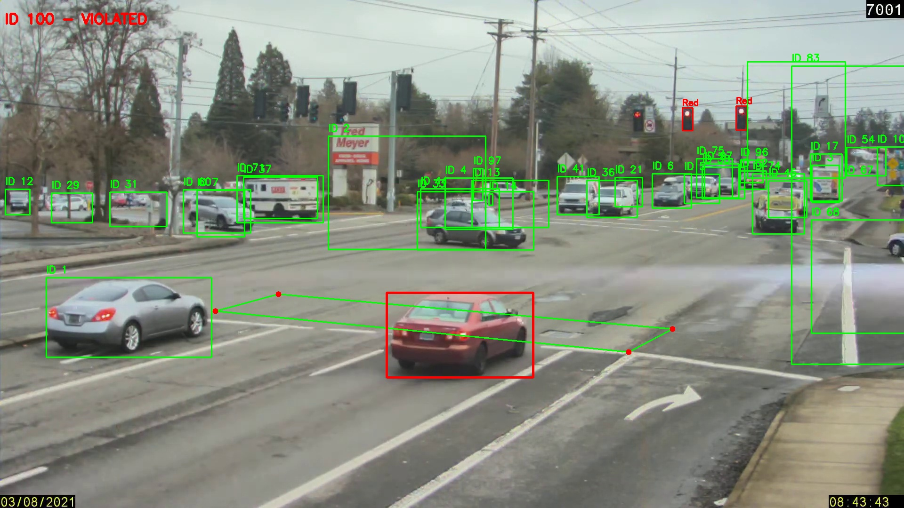
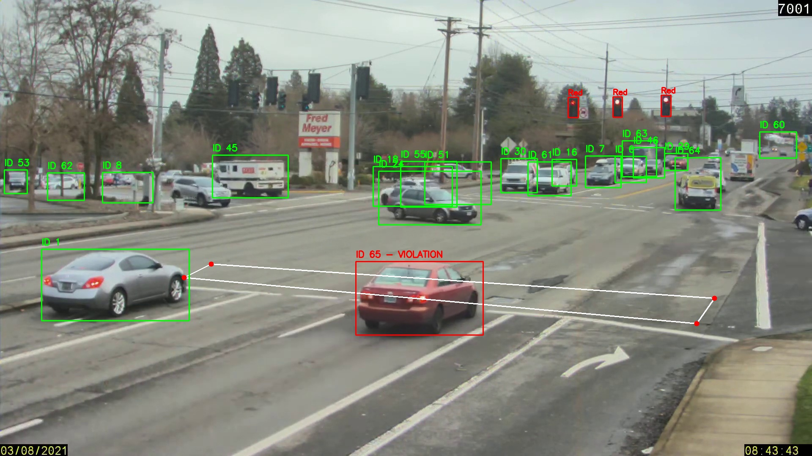
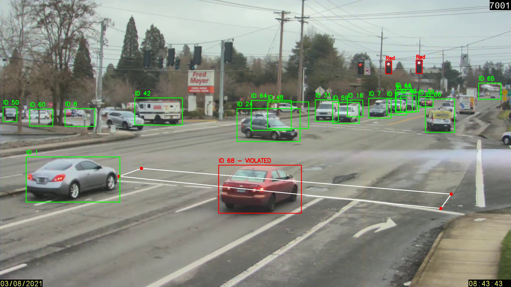
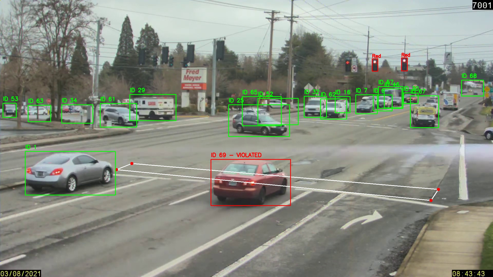

<div align="center">


</div>

<div align="center">

[](https://git.io/typing-svg)

</div>

---

## 📋 Table of Contents

- [Overview](#-overview)
- [Live Detection Screenshot](#-live-detection-screenshot)
- [System Pipeline](#-system-pipeline)
- [How It Works](#-how-it-works)
- [Features](#-features)
- [Evidence Screenshots](#-evidence-screenshots)
- [Pipeline Breakdown](#-pipeline-breakdown)
- [Project Structure](#-project-structure)
- [Installation](#-installation--setup)
- [How to Run](#-how-to-run)
- [Technical Details](#-technical-details)
- [Requirements](#-requirements)
- [Connect With Me](#-connect-with-me)

---

## 🎯 Overview

A **production-grade, autonomous AI traffic surveillance system** that detects and records vehicles running red lights in real time. Using dual **YOLO** models for traffic signal classification and vehicle detection, combined with **DeepSort multi-object tracking**, the system assigns persistent unique IDs to every vehicle — and auto-saves **timestamped screenshot evidence** the moment a violation is detected.

> **No human operator needed — the AI watches, tracks, and records every violation automatically.**

| Feature | Detail |
|:---|:---|
| 🚦 **Signal Detection** | Custom YOLO — Red, Green, RedRight signals |
| 🚗 **Vehicle Tracking** | DeepSort with MobileNet embeddings — robust across occlusions |
| 📐 **ROI Zone** | User-defined polygon (zebra crossing) via mouse click |
| 📸 **Auto Evidence** | Screenshot saved per unique violating vehicle |
| 🛣️ **Multi-Lane** | All vehicles across all lanes tracked simultaneously |
| ⚡ **Real-Time** | Frame-by-frame processing on live or recorded video |

---

## 🖥️ Live Detection Screenshot

> What the system looks like in real time — vehicles at a red light, with bounding boxes, violation labels, and the zebra crossing ROI polygon drawn on screen:

<div align="center">


</div>

> 📌 **Replace with your real screenshots** — add actual output images to `assets/` folder:
> ```markdown
> 
> ```

**Color coding on screen:**
- 🔴 **Red bounding box** → Confirmed violation: vehicle crossed the zebra zone on red
- 🟢 **Green bounding box** → Tracked vehicle: not in violation zone
- 🟩 **Green polygon** → User-defined zebra crossing ROI
- 🔴 **Top-left HUD** → Live violator list + signal state + frame counter

---

## 🏗️ System Pipeline

<div align="center">


</div>

```
📹 Video Input
     │
     ├──► 🚦 Traffic Light YOLO (conf=0.5)
     │         │
     │    Red Light? ──NO──► Skip Frame
     │         │ YES
     │         ▼
     │    🚗 Vehicle YOLO (conf=0.15)
     │         │
     │         ▼
     │    🔁 DeepSort Tracker ──► Persistent Track IDs
     │         │
     │         ▼
     │    📐 pointPolygonTest ──► Inside Zone?
     │         │ YES (new ID)
     │         ▼
     │    📸 Save violation_{id}.jpg
     │         │
     └──► 🖥️ Display Live Overlay
```

---

## ⚙️ How It Works

### Step 1 — Select the Zebra Crossing Zone
On launch, the first video frame opens. The user **clicks 4 points** to define the violation zone (stop line / zebra crossing). The polygon is drawn in real time and confirmed with `C`. Press `A` to reset and redraw.

```
Click point 1  →  Click point 2  →  Click point 3  →  Click point 4
                                                              ↓
                                                    Press 'C' to confirm
```

### Step 2 — Traffic Signal Monitoring (Every Frame)
The **Traffic Light YOLO model** (conf=0.5) classifies the signal state:

| Signal Detected | System Behavior |
|:---:|:---|
| `Red` | 🔴 Violation monitoring **ACTIVE** — vehicle detection starts |
| `RedRight` | 🔴 Violation monitoring **ACTIVE** |
| `Green` | 🟢 Vehicle tracking **PAUSED** — no violations possible |

### Step 3 — Vehicle Detection + Persistent Tracking
When red light is confirmed → **Vehicle YOLO** (conf=0.15) detects all vehicles → passed to **DeepSort** which assigns persistent Track IDs maintained across frames.

### Step 4 — Polygon Intersection Test
For each tracked vehicle, the center point is tested against the polygon:
- **Inside polygon during red** = VIOLATION → screenshot saved, ID flagged red
- **Outside polygon** = normal tracking (green box)

### Step 5 — Auto Evidence Generation
First-time violators (each unique ID captured only once) trigger:
- Screenshot saved: `Violation_ScreenShots/violation_{id}.jpg`
- ID permanently added to `violated_ids` set
- Red overlay + label on live feed
- Violator list updated in top-left HUD

---

## ✨ Features

| Feature | Description |
|:---|:---|
| 🎯 **Dual YOLO Models** | Separate specialized models for signal and vehicle detection |
| 📍 **Interactive ROI** | Click-to-define zone — adapts to any camera angle or intersection |
| 🔢 **Persistent IDs** | Same vehicle keeps same ID across frames, even through occlusion |
| 📸 **Auto Evidence** | Each unique violator photographed exactly once — no duplicates |
| 🔴 **State-Aware** | Tracking only activates on red — zero false positives on green |
| 🛣️ **Multi-Lane** | Simultaneous monitoring across all lanes |
| 🖥️ **Live Overlay** | Bounding boxes, Track IDs, signal state, violator list in real time |
| 🔄 **Occlusion Handling** | `max_age=70` — track survives up to 70 frames without detection |

---

## 📸 Evidence Screenshots

> The system auto-saves evidence like this for every detected violation:

```
Violation_ScreenShots/
├── violation_vehicle_69_frame157.jpg
├── violation_vehicle_68_frame157.jpg  
├── violation_vehicle_65_frame158.jpg 
└── ...
```

Each screenshot contains:
- Full frame at the exact moment of violation
- **Red bounding box** drawn around the violating vehicle
- Text overlay: `"ID {track_id} - VIOLATED"`
- All surrounding vehicles visible for context

> ```markdown
> | Violation 1 | Violation 2 | Violation 3 |
> |:-----------:|:-----------:|:-----------:|
> |  |  |  | 
> ```

---

## 🔬 Pipeline Breakdown

### Zebra Crossing ROI (Mouse-Click Polygon)

```python
def zebra_crossing_roi(video_path, display_width=1280, display_height=720):
    # Shows first frame at display resolution
    # User clicks 4 points → mapped back to original video coordinates
    scale_x = display_width / orig_width
    scale_y = display_height / orig_height

    # On every click — reverse the scaling
    orig_x = int(x / scale_x)
    orig_y = int(y / scale_y)
    # Press 'c' to confirm | 'a' to reset | 'q' to quit
    return np.array(points)     # Shape: (4, 2)
```

### Traffic Light Detection

```python
traffic_results = traffic_light_model.predict(frame, conf=0.5, verbose=False)

for r in traffic_results:
    for box_obj in r.boxes:
        label = r.names[int(box_obj.cls[0])]
        if label in ['Red', 'RedRight']:
            red_light = True    # Activate violation monitoring
```

### Vehicle Detection + DeepSort Tracking

```python
# Format YOLO detections for DeepSort: [x, y, w, h]
detections.append(([x1, y1, x2-x1, y2-y1], conf, "vehicle"))

# DeepSort assigns and maintains persistent Track IDs
tracks = tracker.update_tracks(detections, frame=frame)
```

**DeepSort Configuration:**

```python
tracker = DeepSort(
    max_age=70,             # Keep track alive 70 frames without detection
    n_init=5,               # Confirm track after 5 consecutive detections
    max_iou_distance=0.5,   # IoU threshold for track association
    embedder="mobilenet"    # MobileNet appearance embeddings for re-id
)
```

### Violation Detection & Evidence

```python
def is_vehicle_crossing(box, polygon_points):
    x_center = int((box[0] + box[2]) / 2)
    y_center = int((box[1] + box[3]) / 2)
    # >= 0 → inside or on border = VIOLATION
    return cv2.pointPolygonTest(polygon_points, (x_center, y_center), False) >= 0

# In main loop:
if is_vehicle_crossing([x1,y1,x2,y2], polygon_points):
    if track_id not in violated_ids:
        violated_ids.add(track_id)                    # Permanent — capture once only
        ss = frame.copy()
        cv2.rectangle(ss, (x1,y1),(x2,y2),(0,0,255),3)
        cv2.putText(ss, f"ID {track_id} - VIOLATED", (10,50),
                    cv2.FONT_HERSHEY_SIMPLEX, 1, (0,0,255), 3)
        cv2.imwrite(f"Violation_ScreenShots/violation_{track_id}.jpg", ss)
```

---

## 📁 Project Structure

```
Traffic_Signal_Violation_Detection/
│
├── 📂 NoteBook/
│   └── main.py                           # Main detection pipeline
│
├── 📂 Models/
│   ├── vehicle_detection.pt              # Custom YOLO vehicle model
│   └── Traffic_Light_Detection.pt        # Custom YOLO traffic light model
│
├── 📂 Violation_ScreenShots/             # Auto-generated evidence folder
│   ├── violation_3.jpg
│   ├── violation_7.jpg
│   └── ...
│
├── 📂 assets/                            # README images & diagrams
│   ├── violation_demo.svg                # Live detection demo screenshot
│   └── pipeline_diagram.svg             # System architecture diagram
│
└── README.md
```

---

## 🛠️ Installation & Setup

### Prerequisites
- Python **3.9+**
- GPU recommended (NVIDIA CUDA) for real-time performance
- Video file (CCTV footage / MP4)

### 1. Clone the Repository

```bash
git clone https://github.com/uqasha524/Traffic_Signal_Violation_Detection.git
cd Traffic_Signal_Violation_Detection
```

### 2. Create Virtual Environment

```bash
python -m venv venv

# Windows
venv\Scripts\activate

# Linux / macOS
source venv/bin/activate
```

### 3. Install Dependencies

```bash
pip install ultralytics deep-sort-realtime opencv-python numpy
```

### 4. Add Model Files

```
Models/
├── vehicle_detection.pt          ← Trained YOLO vehicle detection model
└── Traffic_Light_Detection.pt    ← Trained YOLO traffic light model
```

> ⚠️ Model weights are not included due to file size. Train using YOLO or contact the author.

---

## 🚀 How to Run

### Update the Video Path

Open `NoteBook/main.py` and update:

```python
video_path = r"path/to/your/video.mp4"
```

### Run

```bash
cd NoteBook
python main.py
```

### Runtime Controls

| Key | Action |
|:---:|:---|
| **Left Click × 4** | Define zebra crossing polygon on first frame |
| **`C`** | Confirm drawn zone — start processing |
| **`A`** | Reset polygon — redraw from scratch |
| **`Q`** | Quit at any time |

### Expected Console Output

```
Screenshot saved: .\Violation_ScreenShots\violation_3.jpg
Screenshot saved: .\Violation_ScreenShots\violation_7.jpg
Screenshot saved: .\Violation_ScreenShots\violation_15.jpg
```

---

## 🔧 Technical Details

### Why `conf=0.15` for Vehicle Detection?
Dense urban traffic has many partially occluded vehicles. Lower confidence ensures:
- Partially visible vehicles detected early
- Vehicles at frame edges are captured
- No missed violations due to partial visibility

The `n_init=5` DeepSort parameter acts as the quality filter — only vehicles confirmed across 5 consecutive frames get a stable Track ID.

### Why DeepSort + MobileNet Embeddings?
DeepSort uses **visual appearance features** alongside IoU matching:
- Vehicles that disappear temporarily are **re-identified visually** — same ID maintained
- Critical for multi-lane scenarios where vehicles cross each other's paths
- `max_age=70` means a vehicle can be hidden for ~2.3 seconds (30fps) and still recover its ID

### Center-Point Polygon Test
```python
# Uses VEHICLE CENTER POINT — not corners
# Prevents false triggers from adjacent vehicles
x_center = (x1 + x2) / 2
y_center = (y1 + y2) / 2
cv2.pointPolygonTest(polygon, (x_center, y_center), False)  # >= 0 = inside
```

### Scale-Aware Interactive ROI
Display resolution ≠ video resolution. All clicks are mapped back accurately:
```python
scale_x = display_width / orig_width    # e.g., 1280/1920 = 0.667
scale_y = display_height / orig_height  # e.g.,  720/1080 = 0.667

orig_x = int(click_x / scale_x)        # Reverse scale on click
orig_y = int(click_y / scale_y)        # Polygon accurate at any display size
```

---

## 📦 Requirements

```
ultralytics>=8.0
deep-sort-realtime>=1.3
opencv-python>=4.8
numpy>=1.24
```

---

## 🔮 Future Improvements

- [ ] License plate OCR for vehicle registration identification
- [ ] Timestamp + GPS overlay on violation screenshots
- [ ] Violation report export as CSV / PDF
- [ ] Live RTSP IP camera stream support
- [ ] Speed estimation alongside red-light detection
- [ ] Multi-camera intersection coverage
- [ ] Web dashboard for reviewing all violations

---

## 🔗 Connect With Me

<div align="center">

[](mailto:uqashazahid@gmail.com)
[](https://linkedin.com/in/uqasha-zahid)
[](https://github.com/uqasha524)
[](https://huggingface.co/Uqasha)

</div>

<div align="center">

### 🚀 More Projects

| Project | Description | Link |
|:---:|:---|:---:|
| ⚡ **PowerGuard AI** | Dual-stage deep learning SCADA for electricity theft detection in Pakistan's power grid | [🤗 Live Demo](https://huggingface.co/spaces/Uqasha/FYP-Electricity_Theft_Detection) |
| 🕹️ **Action Recognition** | Real-time gaming interface via full-body gestures — 99.69% accuracy | [GitHub](https://github.com/uqasha524) |
| 👁️ **Facial Attendance** | AI biometric attendance system deployed for 100+ users | [GitHub](https://github.com/uqasha524) |

</div>

---

<div align="center">

**Built with ❤️ using Python · YOLO · DeepSort · OpenCV**


</div>
